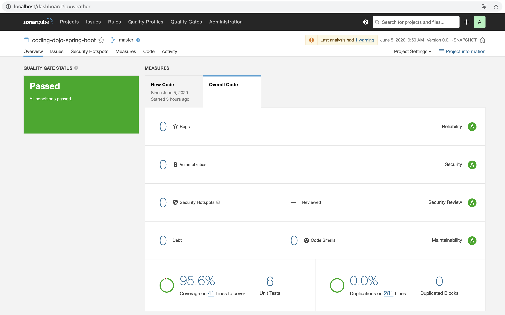
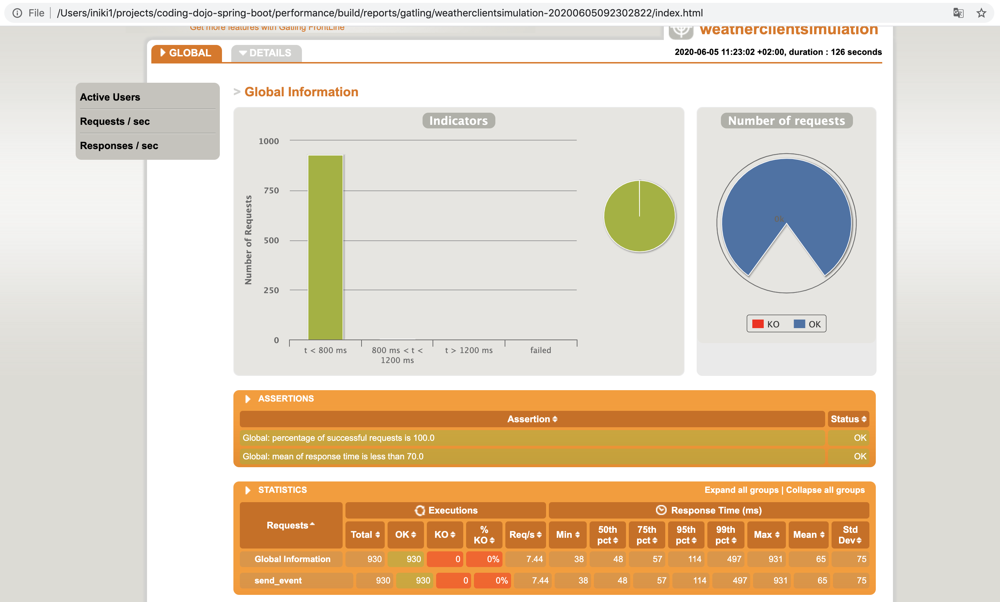

Spring Boot Coding Dojo
---

Welcome to the Spring Boot Coding Dojo!

### Introduction

This is a simple application that requests its data from [OpenWeather](https://openweathermap.org/) and stores the result in a database.

### Developers 

#### Run locally
Run DB

```docker run -e POSTGRES_PASSWORD=password -e POSTGRES_USER=postgres -e POSTGRES_DB=database -p 5432:5432 -d postgres:12```

Run app

```
 ./mvnw spring-boot:run
```

Run tests. Code coverage report provided automatically by Jacoco.
```
 ./mvnw test
```

Run static code analysis

```
 ./mvnw checkstyle:check
```

Run SonarQube 

```
 docker run -d --name sonarqube -p 80:9000 -p 9092:9092 sonarqube
```
Open http://localhost:9000/. Create new project with name `weather` and generate new token.

Run Sonar Scanner

```
 ./mvnw sonar:sonar \
   -Dsonar.projectKey=weather \
   -Dsonar.host.url=http://localhost \
   -Dsonar.login=<token> \
   -Dsonar.exclusions="**/Application.java,**/model/**"
```
if any questions please check this article https://dzone.com/articles/sonarqube-scanning-in-15-minutes-2
Sonar report example:


Run performance tests
```
 cd performance
 ./gradlew gatlingRun
```
Gatling report example:


### Actuator
Actuator endpoints let you monitor and check health of the application.
 -  /actuator - Main endpoint to list all available actuator api 
 -  /actuator/health - Shows application health information.
 -  /actuator/info - Displays arbitrary application info.

### Versioning
Small and frequent releases is one of the core principles of Continues Delivery and Agile software development approaches.  In continuous delivery we aim to get every change in version control as far towards release as we can, getting comprehensive feedback as rapidly as possible.

Core principles:
 - SCM is the ultimate source of truth about project version. Git tags and github releases contains all information about project versions.
 - Semantic Versioning format should be followed when specifying version number (SemVer 2 for ex: v0.1.1).
 
### Production readiness plan (deployment, DB migration and operational readiness are out of the scope)
 - fix issues and make app runnable
 - add bdd integration tests
 - refactor and add unit tests
 - improve error handling
 - add static code analysis checks
 - add gatling performance tests
 - improve performance and verify
 - add actuator, versioning and build info
 - improve documentation
 - improve logging
 - add SonarQube check, fix issues and jacoco tests coverage
 - review
